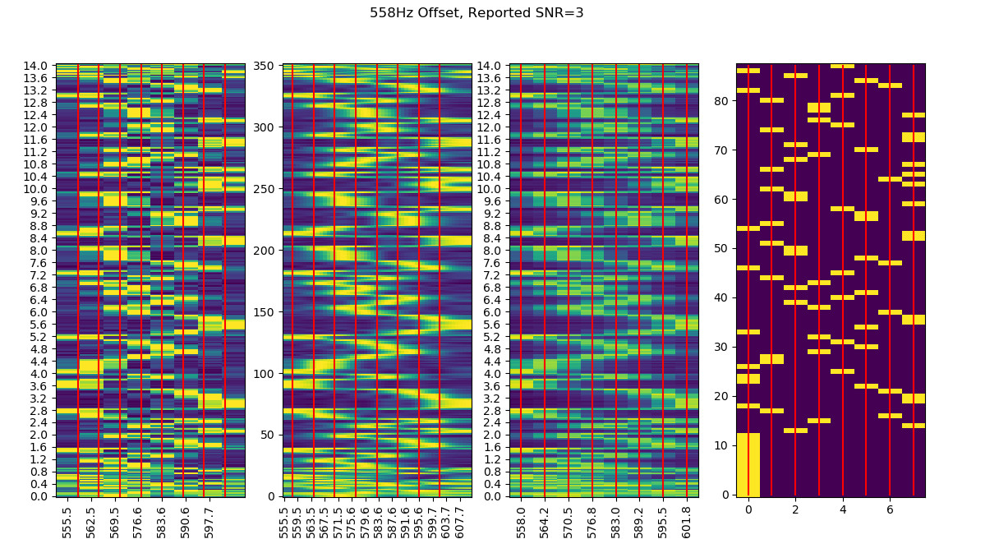
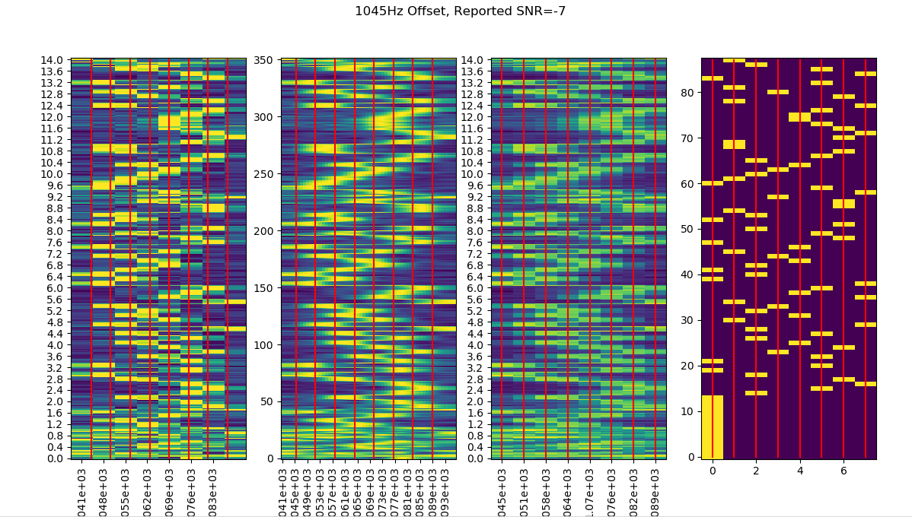
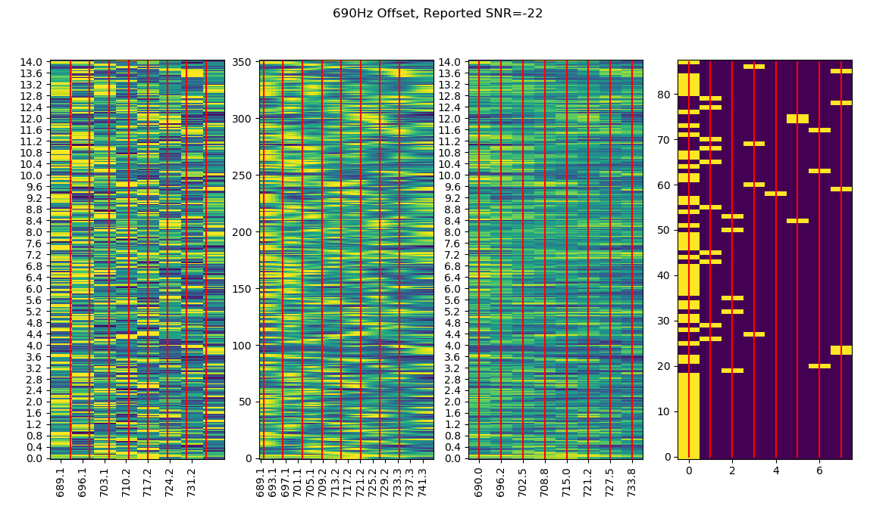

# ft8-experiments

Some experiments on decoding FT8. They're going to specifically be focused
on ways I might be able to decode them on my mcHF running
[UHSDR](https://github.com/df8oe/UHSDR), which cannot store 15sec of samples
and as such would require some form of streaming decoding. This means that
I will not be able to decode all transmissions, especially those whose
initial sync sequences are missing and most likely those which cannot
be decoded via a naive demodulator with the help of the LDPC decoder.

Next step is to take the output and turn it into bytes and run through
the LDPC to get error correction.

Once I think the decoder works, is to build something that
will process the whole band sequentially.

Beyond that I'd like to go back and see about teasing out weaker
signals.

Some Samples output currently. 

